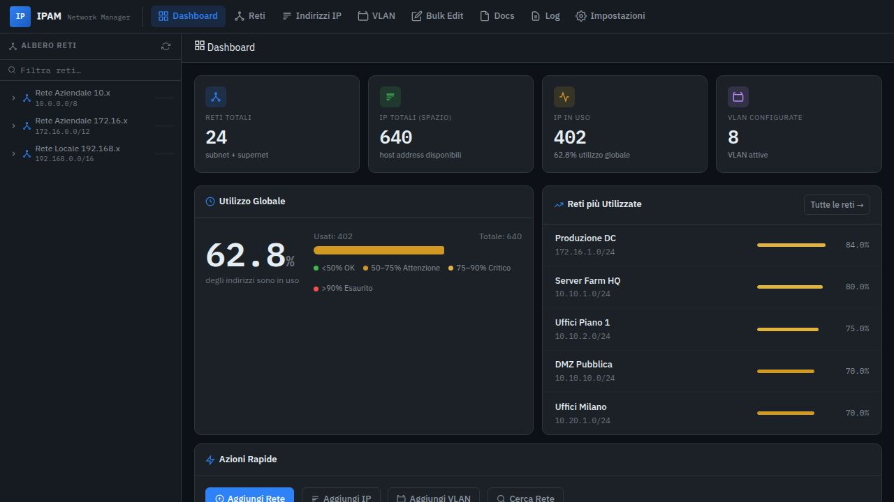
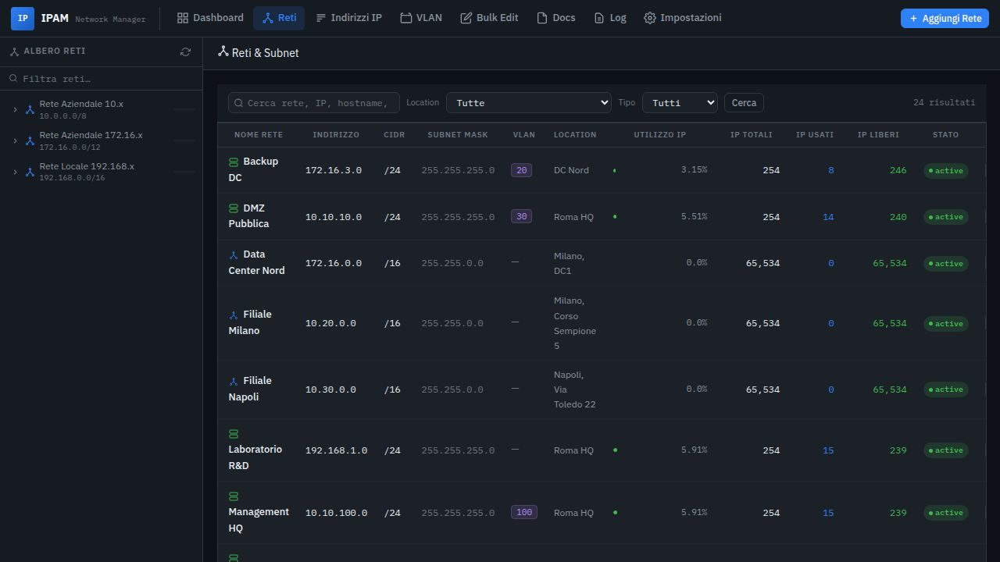
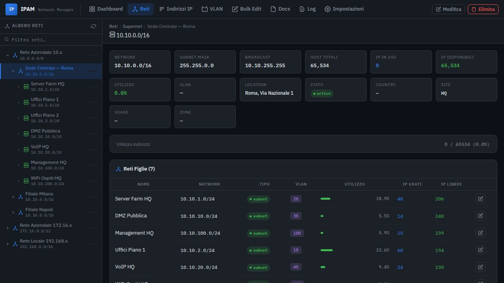
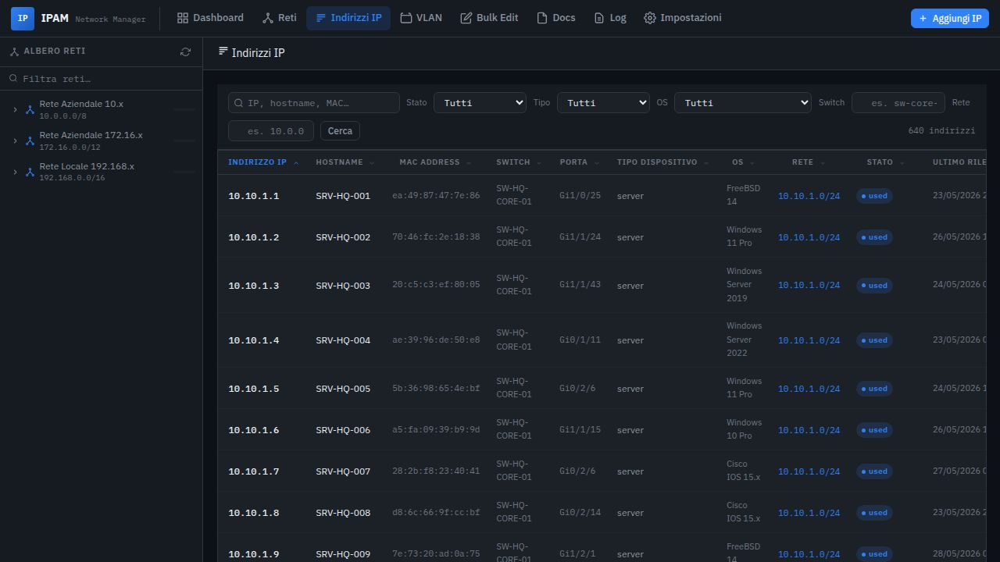
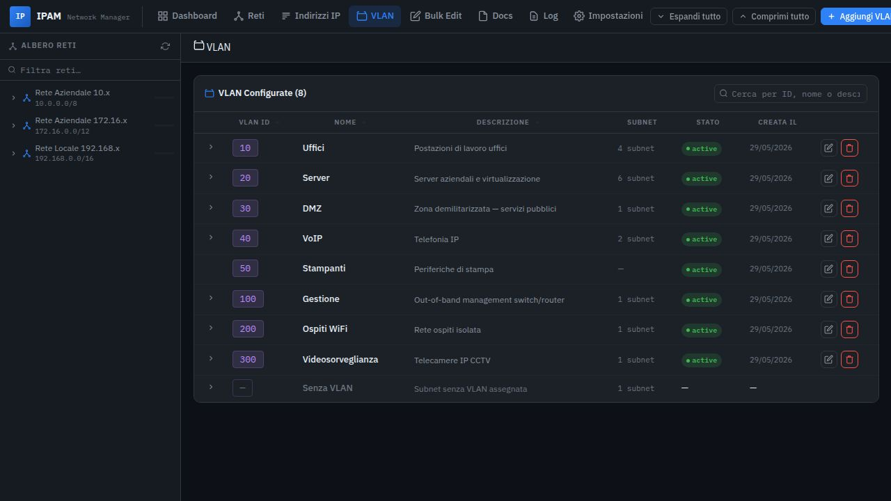
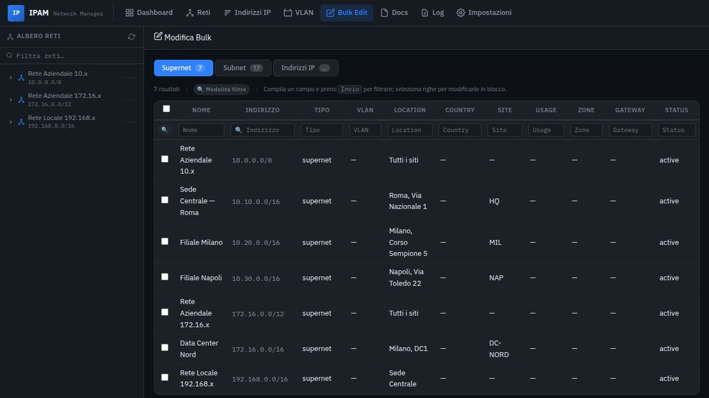
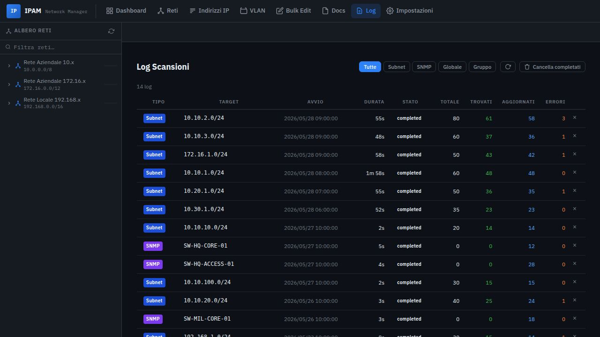
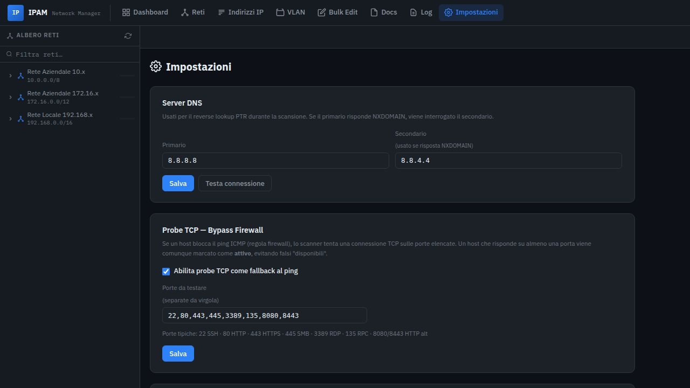
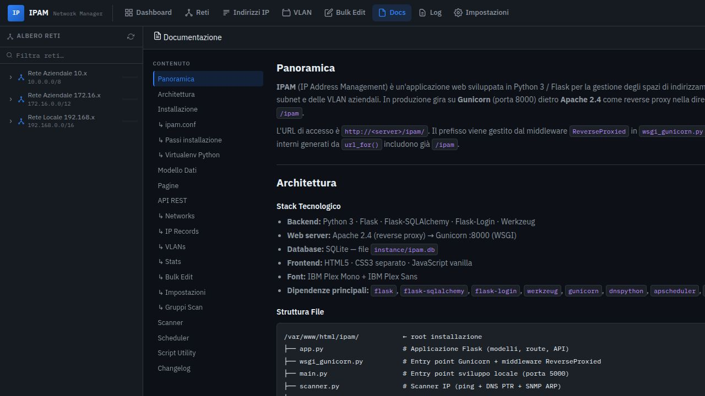
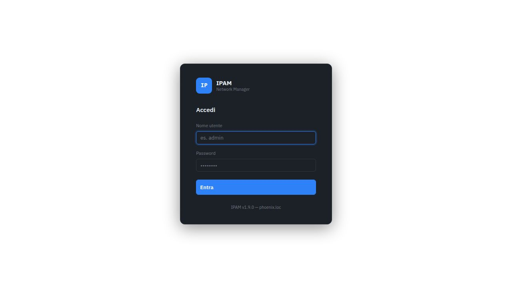

# IPAM — IP Address Management

**IPAM** è un'applicazione web open source per la gestione degli spazi di indirizzamento IP (subnet, indirizzi, VLAN) sviluppata in Python 3 / Flask.

- Interfaccia web in italiano con tema scuro
- Autenticazione locale o LDAP/Active Directory
- Scanner IP integrato (ping ICMP + probe TCP + SNMP)
- Scheduler automatico per scansioni pianificate
- Import da SolarWinds Orion
- API REST completa
- Database SQLite — nessun server esterno richiesto

---

## Download

[](https://github.com/rantonet/ipam/releases/latest)

| Versione | Data | Download |
|---|---|---|
| **v1.9.0** | 2026-05-29 | [ipam_v1.9.0_20260529.zip](https://github.com/rantonet/ipam/releases/download/v1.9.0/ipam_v1.9.0_20260529.zip) |

Tutte le versioni sono disponibili nella pagina [**Releases**](https://github.com/rantonet/ipam/releases).

---

## Indice

- [Screenshot](#screenshot)
- [Requisiti](#requisiti)
- [Installazione](#installazione)
- [Aggiornamento](#aggiornamento)
- [Configurazione Apache](#configurazione-apache)
- [Funzioni principali](#funzioni-principali)
- [API REST](#api-rest)
- [Struttura del progetto](#struttura-del-progetto)

---

## Screenshot

### Dashboard
Statistiche globali in tempo reale: totale reti, IP, utilizzo e le 5 subnet più sature.



---

### Reti & Subnet
Elenco di tutte le reti con albero gerarchico laterale, filtri per location e tipo, e indicatori di utilizzo per ogni subnet.



---

### Dettaglio Rete / Supernet
Vista dettagliata di una singola rete con metriche di utilizzo, reti figlie e tabella degli indirizzi IP con hostname, MAC, switch e porta.



---

### Indirizzi IP — Ricerca Globale
Ricerca e filtraggio su tutti gli indirizzi IP dell'infrastruttura per stato, tipo dispositivo, sistema operativo, switch e rete di appartenenza.



---

### VLAN
Gestione delle VLAN configurate con lista delle subnet associate a ciascuna VLAN.



---

### Modifica Bulk
Aggiornamento in blocco di reti o indirizzi IP: seleziona più record e modifica uno o più campi contemporaneamente.



---

### Log Scansioni
Storico completo delle scansioni eseguite (subnet, SNMP, globale) con statistiche su host trovati, aggiornati ed errori.



---

### Impostazioni
Configurazione server DNS per reverse lookup, porte TCP per il probe firewall-bypass, e gestione dei Gruppi di Scansione pianificata.



---

### Documentazione integrata
Documentazione interna dell'applicazione accessibile direttamente dall'interfaccia web.



---

### Login
Autenticazione locale (username + password) o tramite LDAP/Active Directory configurato nelle impostazioni.



---

## Requisiti

| Componente | Versione minima |
|---|---|
| Python | 3.9+ (consigliato 3.11) |
| Apache | 2.4 |
| mod_proxy / mod_proxy_http | (inclusi in Apache) |
| Sistema operativo | Linux (Debian/Ubuntu/RHEL consigliato) |

Le dipendenze Python vengono installate automaticamente dallo script di installazione in un virtualenv dedicato.

---

## Installazione

### Installazione automatica

```bash
# 1. Scarica e decomprimi il pacchetto
wget https://github.com/rantonet/ipam/releases/download/v1.9.0/ipam_v1.9.0_20260529.zip
unzip ipam_v1.9.0_20260529.zip -d /tmp/ipam_install
cd /tmp/ipam_install

# 2. Esegui lo script di installazione (richiede sudo)
sudo bash install.sh
```

Lo script esegue automaticamente:
1. Creazione della directory `/var/www/html/ipam`
2. Copia di tutti i file dell'applicazione
3. Creazione del virtualenv Python in `/var/www/html/ipam/venv`
4. Installazione delle dipendenze Python (`pip install -r requirements.txt`)
5. Inizializzazione del database SQLite (`instance/ipam.db`)
6. Installazione e abilitazione del servizio systemd `ipam`
7. Restart del servizio

### Installazione manuale

```bash
# Directory di installazione
INSTALL_DIR=/var/www/html/ipam

# 1. Copia i file
sudo mkdir -p $INSTALL_DIR
sudo cp -r . $INSTALL_DIR/
sudo chown -R www-data:www-data $INSTALL_DIR

# 2. Crea il virtualenv e installa dipendenze
cd $INSTALL_DIR
python3 -m venv venv
venv/bin/pip install --upgrade pip
venv/bin/pip install -r requirements.txt

# 3. Crea la directory instance
mkdir -p instance

# 4. Avvia con il servizio systemd (vedi ipam-scan.service)
sudo cp ipam-scan.service /etc/systemd/system/ipam.service
sudo systemctl daemon-reload
sudo systemctl enable ipam
sudo systemctl start ipam
```

### File servizio systemd

Il file `ipam-scan.service` configura Gunicorn sulla porta `8000`:

```ini
[Unit]
Description=IPAM — IP Address Management
After=network.target

[Service]
User=www-data
WorkingDirectory=/var/www/html/ipam
ExecStart=/var/www/html/ipam/venv/bin/gunicorn \
    --workers 2 \
    --bind 127.0.0.1:8000 \
    --timeout 120 \
    wsgi_gunicorn:application
Restart=on-failure

[Install]
WantedBy=multi-user.target
```

---

## Aggiornamento

```bash
# 1. Scarica il nuovo pacchetto e decomprimi
unzip ipam_v1.9.0_20260528.zip -d /tmp/ipam_update
cd /tmp/ipam_update

# 2. Esegui lo script di aggiornamento
sudo bash update.sh
```

Lo script `update.sh`:
- Verifica la versione Python (≥ 3.9)
- Copia i file aggiornati senza toccare `instance/ipam.db`
- Aggiorna le dipendenze Python nel virtualenv
- Esegue `systemctl restart ipam`

> **Nota:** Il database `instance/ipam.db` non viene mai sovrascritto durante l'aggiornamento.

---

## Configurazione Apache

Copia il file `ipam.conf` nella directory di configurazione di Apache e ricarica il servizio:

```bash
sudo cp ipam.conf /etc/apache2/sites-available/ipam.conf
sudo a2ensite ipam
sudo a2enmod proxy proxy_http
sudo systemctl reload apache2
```

Contenuto di `ipam.conf`:

```apache
<VirtualHost *:80>
    ProxyPass        /ipam  http://127.0.0.1:8000/ipam
    ProxyPassReverse /ipam  http://127.0.0.1:8000/ipam
</VirtualHost>
```

L'applicazione sarà accessibile su `http://<server>/ipam`.

---

## Funzioni principali

### Dashboard
- Contatori globali: reti totali, IP totali, IP in uso, VLAN configurate
- Percentuale di utilizzo globale dell'indirizzamento
- Top 5 subnet più utilizzate con barra di utilizzo
- Azioni rapide: aggiungi rete, aggiungi IP, aggiungi VLAN, cerca rete

### Gestione Reti
- **Tipi di rete:** supernet (blocchi aggregati), subnet (reti operative), VLAN
- **Albero gerarchico** navigabile nella sidebar sinistra
- **Campi disponibili per ogni rete:** nome, indirizzo/CIDR, subnet mask, VLAN, location, country, site, usage, zone, gateway, stato, descrizione
- Creazione automatica degli IP record fino a /16 (65.534 host)
- Calcolo automatico delle relazioni parent/child basato sui range IP

### Indirizzi IP
- **Campi per ogni record IP:** IP, hostname, MAC address, switch, porta switch, tipo dispositivo, OS, stato, ultima vista, descrizione
- **Stati disponibili:** `used`, `available`, `reserved`, `dhcp`
- Ricerca globale con filtri combinati (stato + tipo + OS + switch + rete)
- Ordinamento su tutte le colonne

### VLAN
- Anagrafica VLAN con ID, nome, descrizione e stato
- Vista espandibile con tutte le subnet appartenenti a ciascuna VLAN
- Segnalazione delle subnet senza VLAN assegnata

### Modifica Bulk
- Selezione multipla di reti o indirizzi IP
- Aggiornamento simultaneo di uno o più campi su tutti i record selezionati
- Modalità filtro inline per raffinare la selezione

### Scanner IP
Il modulo scanner (`scanner.py`) esegue per ogni subnet:
1. **Ping ICMP** verso ogni indirizzo IP
2. **Probe TCP** (opzionale) su porte configurabili — utile per host con firewall ICMP
3. **Reverse DNS lookup** tramite i server DNS configurati nelle impostazioni
4. Aggiornamento del record IP con hostname, stato e data ultima vista

### SNMP Discovery
Interroga gli switch tramite SNMP per raccogliere:
- Tabella ARP → MAC address degli host
- Bridge/FDB table → porta dello switch per ogni MAC
- Tipo dispositivo e informazioni di sistema

### Scheduler automatico
Gestione dei **Gruppi di Scansione** dalle Impostazioni:
- Ogni gruppo può contenere una o più subnet
- Orario di esecuzione configurabile (HH:MM)
- Esecuzione automatica tramite APScheduler integrato in Flask

### Autenticazione
- **Locale:** username e password hashata con Werkzeug (pbkdf2:sha256)
- **LDAP/Active Directory:** configurabile nelle Impostazioni con server, base DN e bind DN
- Log di autenticazione (login OK, falliti, logout) in `instance/auth.log`

### API REST

Tutti gli endpoint restituiscono JSON. Prefisso `/ipam/api/`.

| Metodo | Endpoint | Descrizione |
|---|---|---|
| GET | `/api/networks` | Lista reti (con filtri) |
| POST | `/api/networks` | Crea nuova rete |
| GET | `/api/networks/<id>` | Dettaglio rete |
| PUT | `/api/networks/<id>` | Aggiorna rete |
| DELETE | `/api/networks/<id>` | Elimina rete |
| POST | `/api/networks/<id>/scan` | Avvia scansione subnet |
| GET | `/api/networks/tree` | Albero gerarchico reti |
| GET | `/api/ip-records` | Lista IP (con filtri) |
| POST | `/api/ip-records` | Crea record IP |
| PUT | `/api/ip-records/<id>` | Aggiorna record IP |
| DELETE | `/api/ip-records/<id>` | Elimina record IP |
| GET | `/api/vlans` | Lista VLAN |
| POST | `/api/vlans` | Crea VLAN |
| PUT | `/api/vlans/<id>` | Aggiorna VLAN |
| DELETE | `/api/vlans/<id>` | Elimina VLAN |
| GET | `/api/scan-logs` | Log scansioni |
| GET | `/api/stats` | Statistiche globali |
| GET | `/api/version` | Versione applicazione |
| POST | `/api/snmp/discover` | Avvia discovery SNMP |
| POST | `/api/bulk-update` | Aggiornamento bulk |

---

## Struttura del progetto

```
/var/www/html/ipam/          ← directory di installazione
├── app.py                   # Applicazione Flask — modelli, route, API
├── wsgi_gunicorn.py         # Entry point produzione (Gunicorn + middleware)
├── main.py                  # Entry point sviluppo (porta 5000)
├── scanner.py               # Scanner IP (ping/DNS/SNMP)
├── requirements.txt         # Dipendenze Python
├── install.sh               # Script installazione
├── update.sh                # Script aggiornamento
├── ipam.conf                # Configurazione Apache
├── ipam-scan.service        # Servizio systemd
├── templates/               # Template Jinja2
│   ├── base.html            # Layout base con navbar
│   ├── index.html           # Dashboard
│   ├── networks.html        # Lista reti
│   ├── network_detail.html  # Dettaglio rete/subnet
│   ├── ip_addresses.html    # Ricerca globale IP
│   ├── vlans.html           # Gestione VLAN
│   ├── bulk_edit.html       # Modifica bulk
│   ├── logs.html            # Log scansioni
│   ├── settings.html        # Impostazioni
│   ├── docs.html            # Documentazione
│   └── login.html           # Pagina di login
├── static/
│   └── css/main.css         # Stile dell'applicazione
├── instance/
│   └── ipam.db              # Database SQLite (NON sovrascrivere)
├── venv/                    # Virtualenv Python (creato da install.sh)
├── scripts/
│   └── post-merge.sh        # Script post-merge CI/CD
└── .github/
    └── workflows/
        └── deploy.yml       # GitHub Actions — test + build zip + deploy SSH
```

---

## Avvio in sviluppo

```bash
cd /var/www/html/ipam
python3 main.py
# oppure con il virtualenv:
venv/bin/python main.py
```

L'app è disponibile su `http://localhost:5000/ipam`.

Credenziali default: `admin` / `admin` (da cambiare immediatamente in produzione).

---

## Comandi utili

```bash
# Stato del servizio
sudo systemctl status ipam

# Restart del servizio
sudo systemctl restart ipam

# Log in tempo reale
sudo journalctl -u ipam -f

# Verifica versione API
curl http://localhost:8000/ipam/api/version

# Verifica dipendenze Python
curl http://localhost:8000/ipam/api/venv-info
```

---

## Licenza

Uso interno — tutti i diritti riservati.
